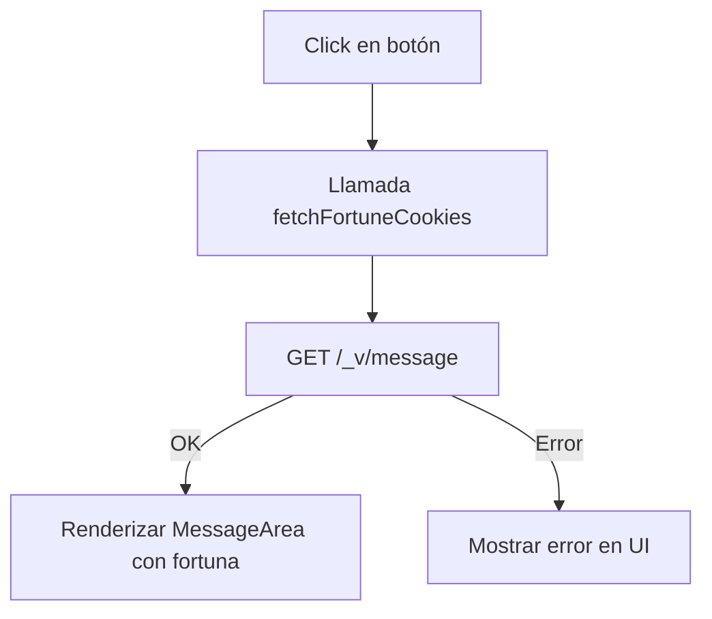

# 📘 Fortune Cooky App

## 1. Información General

- **Vendor:** `valtech`  
- **Nombre de la App:** `fortune-cooky-app`  
- **Versión:** `0.0.0`  
- **Título:** Fortune Cooky App  
- **Descripción:** Aplicación personalizada para VTEX IO que muestra mensajes de galletas de la fortuna consumiendo un microservicio expuesto a través del endpoint `/_v/message`.  
- **Framework:** React + VTEX IO Store Framework.  

---

## 2. Arquitectura

La aplicación está construida sobre el ecosistema **VTEX IO** y utiliza el patrón **Store Block** para integrarse en `store-theme`.  

### 2.1. Estructura del Proyecto

```bash
/react
 ├── components/
 │   ├── ActionButton.tsx
 │   ├── MessageArea.tsx
 │   ├── TextSection.tsx
 │   └── FortuneCookie.tsx
 │
 ├── hooks/
 │   └── useFortuneCookie.ts
 │
 ├── types/
 │   └── index.ts
 │
 └── manifest.json
````

---

### 2.2. Componentes Principales

* **FortuneCookie** → Componente raíz que orquesta la aplicación.
* **MessageArea** → Renderiza la fortuna obtenida desde el servicio.
* **ActionButton** → Botón de acción que dispara la API.
* **TextSection** → Sección de encabezado o subtítulo (personalizable).

### 2.3. Hook Personalizado

* **useFortuneCookie**

  * Maneja la lógica de negocio y la conexión con el microservicio.
  * Implementa un sistema de **retry automático**.
  * Retorna:

    ```ts
    {
      data: { message: string; number: string } | null,
      loading: boolean,
      error: string | null,
      fetchFortuneCookies: () => Promise<void>
    }
    ```

---

## 3. Configuración en VTEX IO

### 3.1. Manifest

```json
{
  "vendor": "valtech",
  "name": "fortune-cooky-app",
  "version": "0.0.0",
  "title": "Fortune cooky App",
  "description": "Custom fortune cooky application for VTEX IO",
  "builders": {
    "react": "3.x",
    "messages": "1.x",
    "docs": "0.x",
    "store": "0.x"
  },
  "dependencies": {
    "vtex.css-handles": "0.x",
    "vtex.store-graphql": "2.x",
    "vtex.search-graphql": "0.x",
    "vtex.styleguide": "9.x"
  },
  "registries": ["smartcheckout"],
  "policies": []
}
```

### 3.2. Store Block

```json
{
  "cookie-fortune-message": {
    "component": "FortuneCookie"
  }
}
```

Uso en `store-theme`:

```json
"cookie-fortune-message": {}
```

---

## 4. API Consumida

* **URL:** `/_v/message`
* **Método:** `GET`

### Respuesta esperada

```json
{
  "data": {
    "message": "Hoy será un gran día",
    "number": "07-12-2025"
  }
}
```

### Manejo de Errores

* Hasta **3 reintentos** con retraso de **300ms**.
* Estados:

  * `loading`: petición en curso.
  * `error`: mensaje legible para el usuario.
  * `data`: fortuna retornada por la API.

---

## 5. Estilos

Manejo de clases con **`vtex.css-handles`**.

### Handles disponibles:

* `fortuneCookieWrapper`
* `container`
* `imageSection`
* `fortuneMessageContainer`
* `fortuneMessagePaper`
* `fortuneText`
* `luckyNumberText`
* `cookieImage`

Ejemplo de override en `store-theme`:

```json
"css": {
  "fortuneText": "custom-fortune-text"
}
```

---

## 6. Flujo de Ejecución

1. Usuario carga el bloque `cookie-fortune-message`.
2. UI muestra botón y espacio vacío.
3. Usuario hace clic → se ejecuta `fetchFortuneCookies`.
4. API responde:

   * Si **OK** → Renderiza mensaje y número.
   * Si **Error** → Muestra mensaje de error.

### Diagrama de Flujo



---

## 7. Instalación y Despliegue

### Requisitos

* Node.js `v16+`
* Yarn
* CLI VTEX IO instalada

### Pasos

```bash
# Instalar dependencias
yarn install

# Seleccionar workspace
vtex use {workspace}

# Linkear en VTEX IO
vtex link

# Publicar
vtex publish
```

Agregar en `store-theme`:

```json
"cookie-fortune-message": {}
```

---

## 8. Consideraciones Técnicas

* **Separation of concerns**: UI ↔ lógica desacoplada.
* **Retry automático** implementado.
* **Customización** mediante `css-handles`.
* **Compatibilidad total** con store-framework como bloque.


